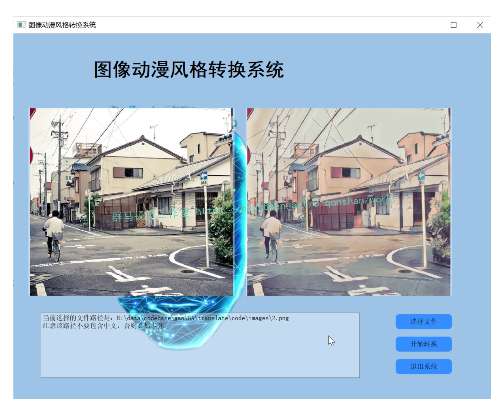
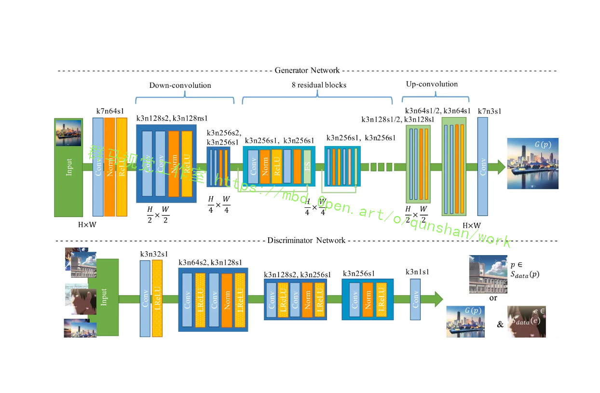
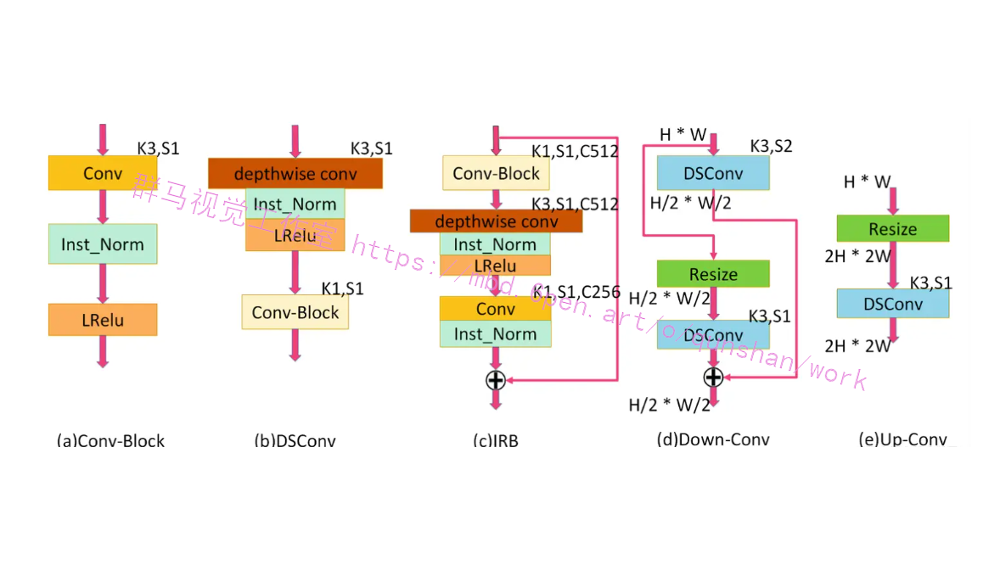
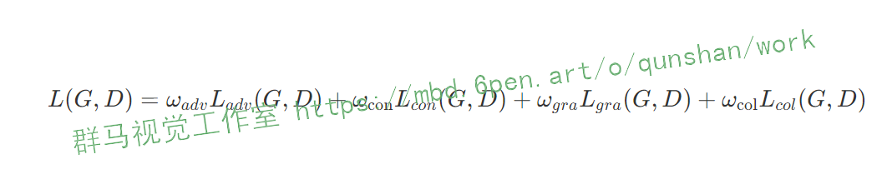
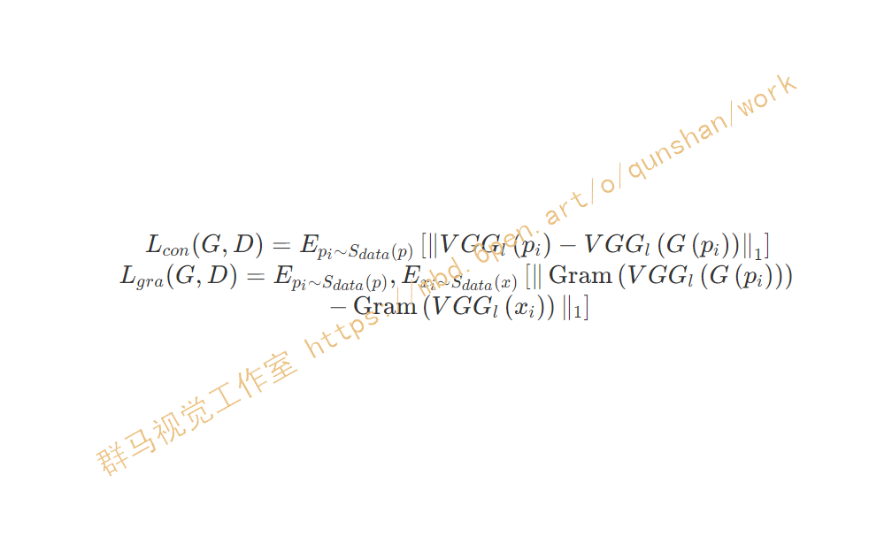
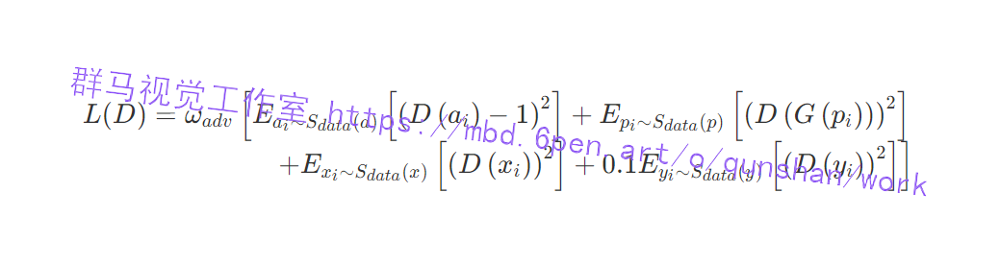

# 1.研究背景

图像风格转换技术已经融入到人们的生活中,并被广泛应用于图像艺术化、卡通化、图像着色、滤镜处理和去遮挡等实际场景中,因此,图像风格转换具有重要的研究意义与应用价值.AnimeGANv2是近年来用于多域图像风格转换的生成对抗网络框架.AnimeGANv2通过简单地下采样提取特征,然后通过上采样生成图片,但是生成图片的背景颜色信息、人物脸部的细节特征会与输入图像有较大差异.对AnimeGANv2的网络结构进行改进,通过引入U-Net和边缘损失函数,提出了用于图像风格转换的UE-AnimeGANv2模型

# 2.图片演示



# 3.视频演示

[改进AnimeGANv2的图像动漫风格转换系统（源码＆教程）_哔哩哔哩_bilibili](https://www.bilibili.com/video/BV1m84y1q7A2/?vd_source=bc9aec86d164b67a7004b996143742dc)


# 4.AnimeGANv2简介
在计算机视觉和艺术风格转移方面，将现实世界场景的照片转换为动漫风格的图像是一项有意义且具有挑战性的任务。我们之前提出的[AnimeGAN结合了神经风格迁移合生成对抗网络（GAN）](https://mbd.pub/o/bread/Y5qbk5dp)来完成这项任务。但是，AnimeGAN仍然存在一些明显的问题，例如模型生成的图像中存在高频伪影。因此，在本研究汇总，我们提出了AnimeGAN的改进版本，即AnimeGANv2。它通过简单的改变网络中特征的归一化来防止高频伪影的产生。此外，我们进一步缩小了生成器网络的规模，以实现更高效的动画风格转换。在新建立的高质量数据集上训练的AnimeGANv2可以生成视觉质量比AnimeGAN更好的动画图像。

# 5.算法改进
为了使生成的图像具有原始照片的内容，引入了[预先训练好的 VGG19](https://afdian.net/item?plan_id=6a6becf858bb11ed93d752540025c377) 作为感知网络，获得生成的图像和原始照片的深度感知特征的L1丢失。
我的理解：跟 CartoonGAN 使用的方法类似，通过预训练模型可以更好的提取图片的高维信息，这样可以在风格不同的情况之下比较两个照片的差别，毕竟两个图像的风格即使不一样，但是高维的语义信息是一样的。这也就是为什么这几个网络不需要像 Cycle GAN 和 Dual GAN 一样需要同时训练两个模型来保证模型的正常收敛。
#### 其他增强
在生成器上执行一个初始化训练，只使用内容丢失Lcon(G, D)对生成网络G进行预先训练，使 AnimeGAN 的训练更容易和更稳定， CartoonGAN 提出的。（没搞懂为什么）
带有 1×1 卷积核的最后一个卷积层不使用归一化层，并且后面使用的是tanh非线性激活函数。（没搞懂为什么）
各个模块中使用的激活函数都是 LReLU。



生成器的网络可以看作是编解码器网络，标准卷积、深度可分离卷积、残差网络、上采样和下采样模块。


# 6.损失函数的改进
首先是对于训练数据的处理，TODO

生成器损失函数主要分为四个部分（[公式图片](https://link.juejin.cn/?target=https%3A%2F%2Fxerrors.oss-cn-shanghai.aliyuncs.com%2Fimgs%2Fmathpix-2021-02-21-12-33-11.png "https://xerrors.oss-cn-shanghai.aliyuncs.com/imgs/mathpix-2021-02-21-12-33-11.png")），不同的损失有不同的权重系数，作者所采用的是 300、1.5、3、10：


1.  对抗损失（adv），是生成器 G 中影响动画转换过程的对抗性损失。
2.  内容损失（con），是帮助生成的图像保留输入照片内容的内容丢失。
3.  灰度风格损失（gra），使生成的图像在纹理和线条上具有清晰的动漫风格。
4.  颜色重建损失（col），使生成的图像具有原照片的颜色。

对于内容丢失和灰度风格丢失，使用预先训练好的VGG19作为感知网络，提取图像的高级语义特征。它们表示为（[此公式的图片](https://link.juejin.cn?target=https%3A%2F%2Fxerrors.oss-cn-shanghai.aliyuncs.com%2Fimgs%2Fmathpix-2021-02-21-12-46-50.png "https://xerrors.oss-cn-shanghai.aliyuncs.com/imgs/mathpix-2021-02-21-12-46-50.png")）:



鉴别器使用的损失函数，除了引入 CartoonGAN 提出的促进边缘的对抗损失，使 AnimeGANv2 生成的图像具有清晰的重现边缘外，还采用了一种新型的灰度对抗损失，防止生成的图像以灰度图像的形式显示。最后，鉴别器的损失函数表示如图。


# 7.代码实现
```
import torch
import torch.nn as nn
import torch.nn.parallel


def weights_init(m):
    classname = m.__class__.__name__
    if classname.find('Conv') != -1:
        m.weight.data.normal_(0.0, 0.02)
    elif classname.find('BatchNorm') != -1:
        m.weight.data.normal_(1.0, 0.02)
        m.bias.data.fill_(0)

# DCGAN model, fully convolutional architecture
class _netG_1(nn.Module):
    def __init__(self, ngpu, nz, nc , ngf, n_extra_layers_g):
        super(_netG_1, self).__init__()
        self.ngpu = ngpu
        #self.nz = nz
        #self.nc = nc
        #self.ngf = ngf
        main = nn.Sequential(
            # input is Z, going into a convolution
            # state size. nz x 1 x 1
            nn.ConvTranspose2d(     nz, ngf * 8, 4, 1, 0, bias=False),
            nn.BatchNorm2d(ngf * 8),
            nn.LeakyReLU(0.2, inplace=True),
            # state size. (ngf*8) x 4 x 4
            nn.ConvTranspose2d(ngf * 8, ngf * 4, 4, 2, 1, bias=False),
            nn.BatchNorm2d(ngf * 4),
            nn.LeakyReLU(0.2, inplace=True),
            # state size. (ngf*4) x 8 x 8
            nn.ConvTranspose2d(ngf * 4, ngf * 2, 4, 2, 1, bias=False),
            nn.BatchNorm2d(ngf * 2),
            nn.LeakyReLU(0.2, inplace=True),
            # state size. (ngf*2) x 16 x 16
            nn.ConvTranspose2d(ngf * 2,     ngf, 4, 2, 1, bias=False),
            nn.BatchNorm2d(ngf),
            nn.LeakyReLU(0.2, inplace=True),
            # state size. (ngf) x 32 x 32
        )

        # Extra layers
        for t in range(n_extra_layers_g):
            main.add_module('extra-layers-{0}.{1}.conv'.format(t, ngf),
                            nn.Conv2d(ngf, ngf, 3, 1, 1, bias=False))
            main.add_module('extra-layers-{0}.{1}.batchnorm'.format(t, ngf),
                            nn.BatchNorm2d(ngf))
            main.add_module('extra-layers-{0}.{1}.relu'.format(t, ngf),
                            nn.LeakyReLU(0.2, inplace=True))

        main.add_module('final_layer.deconv', 
        	             nn.ConvTranspose2d(ngf, nc, 4, 2, 1, bias=False)) # 5,3,1 for 96x96
        main.add_module('final_layer.tanh', 
        	             nn.Tanh())
            # state size. (nc) x 96 x 96

        self.main = main


    def forward(self, input):
        gpu_ids = None
        if isinstance(input.data, torch.cuda.FloatTensor) and self.ngpu > 1:
            gpu_ids = range(self.ngpu)
        return nn.parallel.data_parallel(self.main, input, gpu_ids), 0

class _netD_1(nn.Module):
    def __init__(self, ngpu, nz, nc, ndf,  n_extra_layers_d):
        super(_netD_1, self).__init__()
        self.ngpu = ngpu
        main = nn.Sequential(
            # input is (nc) x 96 x 96
            nn.Conv2d(nc, ndf, 4, 2, 1, bias=False), # 5,3,1 for 96x96
            nn.LeakyReLU(0.2, inplace=True),
            # state size. (ndf) x 32 x 32
            nn.Conv2d(ndf, ndf * 2, 4, 2, 1, bias=False),
            nn.BatchNorm2d(ndf * 2),
            nn.LeakyReLU(0.2, inplace=True),
            # state size. (ndf*2) x 16 x 16
            nn.Conv2d(ndf * 2, ndf * 4, 4, 2, 1, bias=False),
            nn.BatchNorm2d(ndf * 4),
            nn.LeakyReLU(0.2, inplace=True),
            # state size. (ndf*4) x 8 x 8
            nn.Conv2d(ndf * 4, ndf * 8, 4, 2, 1, bias=False),
            nn.BatchNorm2d(ndf * 8),
            nn.LeakyReLU(0.2, inplace=True),
            # state size. (ndf*8) x 4 x 4
        )

        # Extra layers
        for t in range(n_extra_layers_d):
            main.add_module('extra-layers-{0}.{1}.conv'.format(t, ndf * 8),
                            nn.Conv2d(ndf * 8, ndf * 8, 3, 1, 1, bias=False))
            main.add_module('extra-layers-{0}.{1}.batchnorm'.format(t, ndf * 8),
                            nn.BatchNorm2d(ndf * 8))
            main.add_module('extra-layers-{0}.{1}.relu'.format(t, ndf * 8),
                            nn.LeakyReLU(0.2, inplace=True))


        main.add_module('final_layers.conv', nn.Conv2d(ndf * 8, 1, 4, 1, 0, bias=False))
        main.add_module('final_layers.sigmoid', nn.Sigmoid())
        # state size. 1 x 1 x 1
        self.main = main

    def forward(self, input):
        gpu_ids = None
        if isinstance(input.data, torch.cuda.FloatTensor) and self.ngpu > 1:
            gpu_ids = range(self.ngpu)
        output = nn.parallel.data_parallel(self.main, input, gpu_ids)
        return output.view(-1, 1)


class _netD_2(nn.Module):
    def __init__(self, ngpu, nz, nc , ndf):
        super(_netD_2, self).__init__()
        self.ngpu = ngpu
        self.convs = nn.Sequential(
            # input is (nc) x 96 x 96
            nn.Conv2d(nc, ndf, 4, 2, 1, bias=False),
            nn.LeakyReLU(0.2, inplace=True),
            # state size. (ndf) x 32 x 32
            nn.Conv2d(ndf, ndf * 2, 4, 2, 1, bias=False),
            nn.BatchNorm2d(ndf * 2),
            nn.LeakyReLU(0.2, inplace=True),
            # state size. (ndf*2) x 16 x 16
            nn.Conv2d(ndf * 2, ndf * 4, 4, 2, 1, bias=False),
            nn.BatchNorm2d(ndf * 4),
            nn.LeakyReLU(0.2, inplace=True),
            # state size. (ndf*4) x 8 x 8
            nn.Conv2d(ndf * 4, ndf * 8, 4, 2, 1, bias=False),
            nn.BatchNorm2d(ndf * 8),
            nn.LeakyReLU(0.2, inplace=True),
            # state size. (ndf*8) x 4 x 4
            nn.Conv2d(ndf * 8, 1024, 4, 1, 0, bias=False),
            nn.LeakyReLU(inplace=True),
            nn.Dropout(0.5),
            # state size. 1024 x 1 x 1
        )
        self.fcs = nn.Sequential(
            nn.Linear(1024, 1024),
            nn.LeakyReLU(inplace=True),
            nn.Dropout(0.5),
            nn.Linear(1024, 1),            
            nn.Sigmoid()
            )
    def forward(self, input):
        gpu_ids = None
        if isinstance(input.data, torch.cuda.FloatTensor) and self.ngpu > 1:
            gpu_ids = range(self.ngpu)
        output = nn.parallel.data_parallel(self.convs, input, gpu_ids)
        output = self.fcs(output.view(-1,1024))
        return output.view(-1, 1)

# with z decoder and fc layers
class _netG_2(nn.Module):
    def __init__(self, ngpu, nz, nc , ngf):
        super(_netG_2, self).__init__()
        self.ngpu = ngpu
        self.nz = nz
        self.fcs = nn.Sequential(
            # input is Z, going into a convolution
            # state size. nz x 1 x 1
            nn.Linear(nz, 1024),
            nn.ReLU(inplace=True),
            nn.Dropout(0.5),
            nn.Linear(1024, 1024),
            nn.ReLU(inplace=True),
            nn.Dropout(0.5),
            )
        
        self.decode_fcs = nn.Sequential(
            nn.Linear(1024, 1024),
            nn.ReLU(inplace=True),
            nn.Dropout(0.5),
            nn.Linear(1024, nz),
            )

        self.convs = nn.Sequential(
            # 1024x1x1
            nn.ConvTranspose2d(1024, ngf * 8, 4, 1, 0, bias=False),
            nn.BatchNorm2d(ngf * 8),
            nn.ReLU(inplace=True),
            # state size. (ngf*8) x 4 x 4
            nn.ConvTranspose2d(ngf * 8, ngf * 4, 4, 2, 1, bias=False),
            nn.BatchNorm2d(ngf * 4),
            nn.ReLU(inplace=True),
            # state size. (ngf*4) x 8 x 8
            nn.ConvTranspose2d(ngf * 4, ngf * 2, 4, 2, 1, bias=False),
            nn.BatchNorm2d(ngf * 2),
            nn.ReLU(inplace=True),
            # state size. (ngf*2) x 16 x 16
            nn.ConvTranspose2d(ngf * 2,     ngf, 4, 2, 1, bias=False),
            nn.BatchNorm2d(ngf),
            nn.ReLU(inplace=True),
            # state size. (ngf) x 32 x 32
            nn.ConvTranspose2d(    ngf,      nc, 4, 2, 1, bias=False),
            nn.Tanh()
            # state size. (nc) x 96 x 96
        )
    def forward(self, input):
        input = self.fcs(input.view(-1,self.nz))
        gpu_ids = None
        if isinstance(input.data, torch.cuda.FloatTensor) and self.ngpu > 1:
            gpu_ids = range(self.ngpu)
        z_prediction = self.decode_fcs(input)
        input = input.view(-1,1024,1,1)
        output = nn.parallel.data_parallel(self.convs, input, gpu_ids)
        return output, z_prediction


# DCGAN model with fc layers
class _netG_3(nn.Module):
    def __init__(self, ngpu, nz, nc , ngf):
        super(_netG_3, self).__init__()
        self.ngpu = ngpu
        self.fcs = nn.Sequential(
            # input is Z, going into a convolution
            # state size. nz x 1 x 1
            nn.Linear(nz, 1024),
            nn.ReLU(inplace=True),
            nn.Dropout(0.5),
            nn.Linear(1024, 1024),
            nn.ReLU(inplace=True),
            nn.Dropout(0.5),
            )
        self.convs = nn.Sequential(
            # 1024x1x1
            nn.ConvTranspose2d(1024, ngf * 8, 4, 1, 0, bias=False),
            nn.BatchNorm2d(ngf * 8),
            nn.ReLU(inplace=True),
            # state size. (ngf*8) x 4 x 4
            nn.ConvTranspose2d(ngf * 8, ngf * 4, 4, 2, 1, bias=False),
            nn.BatchNorm2d(ngf * 4),
            nn.ReLU(inplace=True),
            # state size. (ngf*4) x 8 x 8
            nn.ConvTranspose2d(ngf * 4, ngf * 2, 4, 2, 1, bias=False),
            nn.BatchNorm2d(ngf * 2),
            nn.ReLU(inplace=True),
            # state size. (ngf*2) x 16 x 16
            nn.ConvTranspose2d(ngf * 2,     ngf, 4, 2, 1, bias=False),
            nn.BatchNorm2d(ngf),
            nn.ReLU(inplace=True),
            # state size. (ngf) x 32 x 32
            nn.ConvTranspose2d(    ngf,      nc, 4, 2, 1, bias=False),
            nn.Tanh()
            # state size. (nc) x 96 x 96
        )
    def forward(self, input):
        input = self.fcs(input.view(-1,nz))
        gpu_ids = None
        if isinstance(input.data, torch.cuda.FloatTensor) and self.ngpu > 1:
            gpu_ids = range(self.ngpu)
        input = input.view(-1,1024,1,1)
        return nn.parallel.data_parallel(self.convs, input, gpu_ids)
```

# 8.系统整合


# 9.[完整源码＆环境部署视频教程＆自定义UI界面](https://s.xiaocichang.com/s/0ffb89)

# 10.参考文献
***
[1]欧阳宁,梁婷,林乐平.基于自注意力网络的图像超分辨率重建[J].计算机应用.2019,(8).DOI:10.11772/j.issn.1001-9081.2019010158.
[2]朱新山,姚思如,孙彪,等.图像质量评价：融合视觉特性与结构相似性指标[J].哈尔滨工业大学学报.2018,(5).DOI:10.11918/j.issn.0367-6234.201709138.
[3]姚乃明,郭清沛,乔逢春,等.基于生成式对抗网络的鲁棒人脸表情识别[J].自动化学报.2018,(5).DOI:10.16383/j.aas.2018.c170477.
[4]高媛,刘志,秦品乐,等.基于深度残差生成对抗网络的医学影像超分辨率算法[J].计算机应用.2018,(9).DOI:10.11772/j.issn.1001-9081.2018030574.
[5]周飞燕,金林鹏,董军.卷积神经网络研究综述[J].计算机学报.2017,(6).DOI:10.11897/SP.J.1016.2017.01229.
[6]卢宏涛,张秦川.深度卷积神经网络在计算机视觉中的应用研究综述[J].数据采集与处理.2016,(1).DOI:10.16337/j.1004-9037.2016.01.001.
[7]李生.自然语言处理的研究与发展[J].燕山大学学报.2013,(5).DOI:10.3969/j.issn.1007-791X.2013.05.001.
[8]常建英.基于生成对抗网络的图像风格转换[D].2021
[9]Huynh-Thu Q.,Ghanbari M..Scope of validity of PSNR in image/video quality assessment[J].Electronics Letters.2008,44(13).
[10]Bovik A.C.,Zhou Wang,Simoncelli E.P.,等.Image quality assessment: from error visibility to structural similarity[J].IEEE Transactions on Image Processing.2004,13(4).

---
#### 如果您需要更详细的【源码和环境部署教程】，除了通过【系统整合】小节的链接获取之外，还可以通过邮箱以下途径获取:
#### 1.请先在GitHub上为该项目点赞（Star），编辑一封邮件，附上点赞的截图、项目的中文描述概述（About）以及您的用途需求，发送到我们的邮箱
#### sharecode@yeah.net
#### 2.我们收到邮件后会定期根据邮件的接收顺序将【完整源码和环境部署教程】发送到您的邮箱。
#### 【免责声明】本文来源于用户投稿，如果侵犯任何第三方的合法权益，可通过邮箱联系删除。